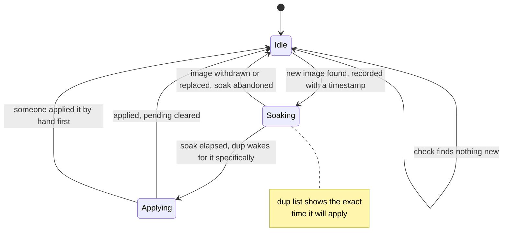

# dup documentation

Everything needed to install, configure, run and remove dup. The [README](README.md) is the
short version; this is the reference.

- [Installing](#installing)
- [First run](#first-run)
- [Upgrading](#upgrading)
- [Uninstalling](#uninstalling)
- [Commands](#commands)
- [Configuration](#configuration)
- [Exposing the port](#exposing-the-port)
- [Restricting who can reach it](#restricting-who-can-reach-it)
- [Health checks and what healthy means](#health-checks-and-what-healthy-means)
- [The API](#the-api)
- [Wiring it up](#wiring-it-up)
- [Operating it](#operating-it)
- [Troubleshooting](#troubleshooting)

For the privilege split, the threat model and the ownership audit, see [SECURITY.md](SECURITY.md).

---

## Installing

```sh
curl -fsSL https://raw.githubusercontent.com/9technologygroup/docker-updater/main/install.sh | sudo sh
```

That downloads the release for your architecture, verifies it against `checksums.txt`, creates the `dup` system account, installs both binaries and both units, generates a bearer token, a GitHub webhook secret and a self-signed TLS certificate, and sets the file ownership the security model depends on.

Or with a package:

```sh
# Debian / Ubuntu
curl -fsSLO https://github.com/9technologygroup/docker-updater/releases/latest/download/dup_linux_amd64.deb
sudo dpkg -i dup_linux_amd64.deb

# RHEL / Fedora / Rocky
sudo rpm -i https://github.com/9technologygroup/docker-updater/releases/latest/download/dup_linux_amd64.rpm

# Alpine
sudo apk add --allow-untrusted dup_linux_amd64.apk
```

Or from source:

```sh
git clone https://github.com/9technologygroup/docker-updater
cd docker-updater
make build-linux
sudo ./install.sh
```

Both binaries go to `/usr/bin`, the same place the packages put them.

## First run

The installer writes a starter `/etc/dup/config.yml` with **no stacks in it** and starts
both services. That is deliberate: dup comes up managing nothing, which is what lets it
show you the host before you have decided anything.

```sh
sudo dup list
```

That lists every compose project and loose container dup is not covering, which is the
list you pick from. Add the ones you want under `targets:` in the config, which ships with
a fully commented example showing every field and whether it is required, then:

```sh
sudo nano /etc/dup/config.yml   # or vim, or whatever you use

sudo dup check     # the config parses and matches this host
sudo dup audit     # the dup account cannot rewrite what runs as root
sudo systemctl restart dup-agent dup
```

Run `dup audit` properly once you have real stacks listed. With an empty config it passes
without proving anything, because there is nothing yet for the service account to be able
to rewrite. `dup-agent.service` runs both `check` and `audit` as `ExecStartPre`, so from
then on they gate every start.

Then check on it:

```sh
systemctl status dup-agent dup
journalctl -u dup -u dup-agent -f
sudo dup status
```

`/etc/dup/config.yml` is `root:dup 0640`, so these read it as root. To run them as
yourself, join the group once: `sudo usermod -aG dup $USER`, then log out and back in.

**TLS is on out of the box.** The installer generates `/etc/dup/self-signed.crt` and
`/etc/dup/self-signed.key` before you copy the reference config, and that config ships
with TLS enabled and those paths already filled in, so dup serves HTTPS from the first
start with nothing to edit. An upgrade never regenerates or replaces a certificate that
already exists.

```yaml
tls:
  enabled: true
  self_signed: true
  cert_file: /etc/dup/self-signed.crt
  key_file: /etc/dup/self-signed.key
```

| Setting | Effect |
|---|---|
| `enabled: false` | Plain HTTP, whatever the other fields say. For a reverse proxy that already terminates TLS in front of `127.0.0.1` |
| `self_signed: true` | dup generates the pair, and `dup cert --force` may replace it |
| `self_signed: false` | The certificate is yours. dup will never overwrite it; point `cert_file` and `key_file` at it |

`enabled` is what decides it. Leave it out and TLS is inferred from the rest of the
block, which is how configs written before it existed behave.

### Upgrading

`dup version` tells you when there is a newer release:

```
$ dup version
dup v1.3.0 (4b81de7)
a newer dup is available: v1.4.0 (you have v1.3.0)
  upgrade:  curl -fsSL https://raw.githubusercontent.com/9technologygroup/docker-updater/main/install.sh | sudo sh
  notes:    https://github.com/9technologygroup/docker-updater/releases/tag/v1.4.0
```

The version itself goes to stdout and the advisory to stderr, so `dup version` stays safe to capture in a script. The running service checks once at startup and daily after that, logging `a newer dup is available`, and `GET /v1/version` reports the same thing from cache. Set `DUP_NO_UPDATE_CHECK=1` to switch all of it off, `dup version --check` to check right now, and `DUP_GITHUB_TOKEN` if a shared egress address runs into the unauthenticated rate limit.

To upgrade, re-run the installer or `apt install --only-upgrade dup`. Either replaces both binaries and leaves `/etc/dup/config.yml`, the bearer token and the GitHub secret alone.

```sh
curl -fsSL https://raw.githubusercontent.com/9technologygroup/docker-updater/main/install.sh | sudo sh
```

The installer validates your existing config **with the new binary before replacing anything**, so a config the new version rejects leaves the old one running rather than half-applying. Pin a specific version with `DUP_VERSION=v1.2.3` in front of it.

There is deliberately no `dup upgrade`. The binaries are `root:root` and the service runs unprivileged, so self-replacement would either need root in the agent or break the privilege split, and a tool built on health checks and rollback should not swap itself out with a mechanism that has neither.

### Uninstalling

The installer keeps a copy of itself, so uninstalling needs nothing downloaded:

```sh
sudo /usr/share/dup/install.sh --uninstall            # stop and remove dup, keep /etc/dup
sudo /usr/share/dup/install.sh --uninstall --purge    # also remove /etc/dup and the dup account
```

Straight from the network, if you would rather. Note `sh -s --`, without which the
flags are read by `sh` itself rather than passed to the script, and `--yes`, because
the pipe occupies stdin so nothing can read your answer to the prompt:

```sh
curl -fsSL https://raw.githubusercontent.com/9technologygroup/docker-updater/main/install.sh \
  | sudo sh -s -- --uninstall --purge --yes
```

Without `--purge` the config, both secrets and the TLS certificate survive, so reinstalling
picks up where you left off. `--purge` deletes them.

It asks before doing anything. Add `-y` to skip that, which is also required when running
it non-interactively, so a piped invocation cannot silently wipe a host.

If dup came from a `.deb` or `.rpm` the script refuses and points you at the package
manager, because removing the files behind its back leaves the package database describing
files that are no longer there. `--force` overrides that.

**Your compose stacks are not touched.** Whatever dup was updating keeps running; only dup
itself is removed.

---

## Commands

Every command takes `--config <path>`, defaulting to `/etc/dup/config.yml`. Flags and the
stack name work in either order, so `dup update --dry-run web` and `dup update web --dry-run`
do the same thing. `dup <command> -h` prints that command's flags and exits 0.

| Command | What it does |
|---|---|
| `dup list` | Stacks, their update policy, when each is next checked, anything mid-flight, and every compose project or container on the host that dup is **not** covering |
| `dup logs [stack]` | Finished updates, newest first, read from disk so they survive a restart |
| `dup status [stack]` | Alias for `dup logs` |
| `dup scan [stack]` | Check against the registry now, without updating anything |
| `dup update <stack>` | Trigger an update |
| `dup check` | Validate the config, and warn if the running agent has a different one |
| `dup audit` | Prove the service account cannot rewrite what runs as root |
| `dup cert` | Generate the self-signed TLS certificate. Root only |
| `dup version` | Version, commit, and whether a newer release is out |
| `dup serve` | The unprivileged HTTP API. systemd runs this |
| `dup-agent` | The privileged agent. systemd runs this |

`dup list` is the one to reach for first. It answers "what is dup responsible for, what is
waiting to apply, and what is quietly drifting outside it".

### Flags

| Command | Flag | Default | Meaning |
|---|---|---|---|
| all | `--config` | `/etc/dup/config.yml` | Path to the config file |
| `update` | `--tag` | none | Image tag to deploy. Only for targets with `image_tag_env` set, otherwise refused |
| `update` | `--reason` | none | Free text recorded on the job, so `dup logs` says why |
| `update` | `--dry-run` | `false` | Pull and report what would change, recreating nothing |
| `update` | `--force` | `false` | Recreate even when the images have not changed. For a container misbehaving on the image it is already on |
| `update` | `--wait` | `4m` | How long to wait for the result. Clamped to the 5m the API will hold a request open |
| `logs` | `--limit` | `20` | How many jobs to show |
| `logs` | `--job` | none | Show one job in full, with every step and its output. A prefix of the id is enough |
| `logs` | `--full` | `false` | Show every step of each job, not just the summary |
| `scan` | `--timeout` | `15m` | Budget for the whole scan across every stack |
| `list` | `--all` | `false` | Also list compose projects dup already covers |
| `cert` | `--force` | `false` | Replace an existing certificate |
| `cert` | `--defaults` | `false` | Generate at the default paths without reading a config, which is what the installer uses on a fresh host |
| `version` | `--full` | `false` | Add commit, build date, toolchain, licence, source and the latest release |
| `version` | `--check` | `false` | Check for a newer release now, ignoring the cache |
| `version` | `--no-check` | `false` | Skip the release check entirely |

`dup-agent` takes only `-config`, plus `-version`, `-ver` or `-v`.

### Exit codes

| Code | When |
|---|---|
| `0` | Success, including a dry run, a `no_change`, and asking for help |
| `1` | Anything else: a failed update, a rolled-back update, an unreachable API or agent, an invalid config, a stack that could not be scanned |

An update that is still running when `--wait` expires exits `0` and tells you to follow it
with `dup logs`, because it has not failed.

### Environment variables

| Variable | Used by | Meaning |
|---|---|---|
| `DUP_NO_UPDATE_CHECK` | `dup` | Any non-empty value disables the release check everywhere, including in `dup serve`. Absolute: `--check` cannot override it |
| `DUP_GITHUB_TOKEN` | `dup` | Authenticates the release check, which lifts the unauthenticated 60 requests an hour limit. Useful when several hosts share an egress address |
| `DUP_GITHUB_REPO` | `dup`, `install.sh` | Check and install from a fork rather than `9technologygroup/docker-updater` |
| `DUP_CACHE_FILE` | `dup` | Where the release check caches its answer. Defaults to `/var/lib/dup/update-check.json` |
| `DUP_VERSION` | `install.sh` | Install a specific tag rather than the latest release |
| `UPDATER_BEARER_TOKEN` | `dup` | Overrides the bearer token from the config, including the file form |
| `UPDATER_GITHUB_SECRET` | `dup` | Overrides the GitHub webhook secret from the config |

The last two are read from the environment of whichever process loads the config, so setting
them means putting a secret in a systemd unit or a shell. The file form is preferred.

---

## Configuration

One file, `/etc/dup/config.yml`, owned `root:dup 0640`. The reference config the installer
drops at `/etc/dup/config.example.yml` carries the same content as comments.

Unknown keys are rejected at load rather than ignored, so a typo is an error rather than a
setting that silently does nothing.

### Top level

| Key | Default | Meaning |
|---|---|---|
| `listen` | `127.0.0.1:7788` | Address the API binds. Off-loopback without TLS is refused unless `allow_non_loopback` |
| `allow_non_loopback` | `false` | Permit plaintext on a non-loopback address. dup complains in the log if you do |
| `agent_socket` | `/run/dup/agent.sock` | Unix socket to the privileged agent. Absolute, and under 100 bytes because that is the kernel limit |
| `agent_peer_user` | none, required | The account the API runs as. The agent accepts connections only from this uid and root |
| `log_level` | `info` | `debug`, `info`, `warn` or `error` |
| `log_file` | `/var/log/dup/dup.log` | Second copy of the log, rotated and gzipped by dup. `none` disables. The journal always gets everything regardless |
| `log_max_size_mb` | `10` | Rotate the log at this size |
| `log_keep` | `5` | Gzipped log archives to keep |
| `history_file` | `/var/lib/dup/history.jsonl` | Durable record of finished updates, which is what `dup logs` reads. `none` disables |
| `history_max_size_mb` | `8` | Rotate the history at this size |
| `history_keep` | `4` | Gzipped history archives to keep |

The agent writes its own log beside yours, at `/var/log/dup-agent/dup-agent.log`, in a
separate directory so the unprivileged account cannot rewrite the root process's record.

### `tls`

| Key | Default | Meaning |
|---|---|---|
| `enabled` | inferred | The switch. Set it and it wins outright. Leave it out and TLS is inferred from the rest of the block, which is how configs written before it existed behave |
| `self_signed` | `false` | dup generates and may replace the pair. `dup cert` refuses to touch a certificate you manage |
| `cert_file` | `/etc/dup/self-signed.crt` when `self_signed` | Certificate to serve |
| `key_file` | `/etc/dup/self-signed.key` when `self_signed` | Its private key. Must be set together with `cert_file` |
| `hosts` | hostname, `localhost`, `127.0.0.1`, `::1`, plus the `listen` host | Names and IPs to put in a generated certificate. Only used when dup generates one |

### `auth`

At least one of the two must be configured, or the config is refused. Each secret must be at
least 32 characters.

| Key | Meaning |
|---|---|
| `bearer_token_file` | Absolute path to the token file. Preferred over the inline form |
| `bearer_token` | The token inline. Cleared from memory after load |
| `github_secret_file` | Absolute path to the webhook HMAC secret |
| `github_secret` | The secret inline |

A secret file must be a regular file, owned by root, not world accessible or group writable,
and not sitting in a group or world writable directory. Anything else is refused rather than
used. `UPDATER_BEARER_TOKEN` and `UPDATER_GITHUB_SECRET` in the environment take precedence
over both forms.

### `allow_from`, `trusted_proxies`, `cors`

| Key | Default | Meaning |
|---|---|---|
| `allow_from` | empty, meaning anywhere that can reach the port | IPs or CIDRs permitted to call the API |
| `trusted_proxies` | empty | IPs or CIDRs whose `X-Forwarded-For` is believed. With this empty, the header is ignored entirely and the peer address is used |
| `cors.allowed_origins` | empty, CORS off | Exact origins that may call the API from a browser. `*` is refused |

### `notify`

| Key | Default | Meaning |
|---|---|---|
| `url` | empty, disabled | Where to POST the result of every finished job. `http` or `https` only |
| `timeout` | `15s` | How long to wait for it |
| `headers` | none | Extra headers, for an auth token on the receiving end |

### `defaults`

Every one of these is the fallback for the target key of the same name.

| Key | Default |
|---|---|
| `check_interval` | `6h` |
| `soak` | `30m` |
| `pull_timeout` | `10m` |
| `health_timeout` | `3m` |
| `job_timeout` | `25m` |
| `stability_window` | `15s` |
| `rollback` | `true` |

### `targets`

A config with no targets is valid: dup starts, manages nothing, and `dup list` shows you the
host so you can decide what it should own.

| Key | Required | Default | Meaning |
|---|---|---|---|
| `name` | **yes** | | What callers refer to. Must match `^[a-z0-9][a-z0-9._-]{0,63}$` |
| `dir` | **yes** | | Absolute path holding the compose file. Commands run here, so `.env` resolves exactly as it does by hand |
| `compose_file` | no | first of `compose.yaml`, `compose.yml`, `docker-compose.yaml`, `docker-compose.yml` found in `dir` | Bare filename inside `dir`. A path, or a symlink pointing outside `dir`, is refused |
| `env_file` | no | compose's own `.env` handling | Bare filename inside `dir`, passed as `--env-file`. Same path and symlink rules as `compose_file` |
| `services` | no | every service | Restrict the update to these. Also the health-check scope. Each must match `^[a-zA-Z0-9][a-zA-Z0-9._-]{0,127}$` |
| `auto_update` | no | `false` | Poll for a new image and apply it without being asked |
| `check_interval` | no | `defaults.check_interval` | How often to poll. Minimum `1m`, and only used when `auto_update` is on |
| `soak` | no | `defaults.soak` | How long a new image must have been available before it is applied. `0s` applies on sight. Cannot be negative |
| `rollback` | no | `defaults.rollback` | Restore the previous images if the update does not come up healthy |
| `health_timeout` | no | `defaults.health_timeout` | How long to wait for services to settle before calling the update failed |
| `stability_window` | no | `defaults.stability_window` | How long they must stay settled. **Must be shorter than `health_timeout`**, which is enforced at load. See [Health checks](#health-checks-and-what-healthy-means) |
| `pull_timeout` | no | `defaults.pull_timeout` | Budget for `docker compose pull` |
| `job_timeout` | no | `defaults.job_timeout` | Budget for the whole update, pull and health check included |
| `image_tag_env` | no | unset | Enables the `tag` parameter, exported to compose so `image: repo:${APP_VERSION}` becomes settable per request. Must match `^[A-Z][A-Z0-9_]{0,63}$`. Without it a tag is refused |
| `allow_prerelease` | no | `false` | Whether a GitHub pre-release webhook triggers an update |
| `pre_update` | no | none | A command to run before anything is recreated. See below |

### `pre_update`

Runs **as root**, from the agent, with the working directory set to `dir`. No shell, so `args`
is a list. See [Backups before an update](#backups-before-an-update) for what to use it for,
and [SECURITY.md](SECURITY.md) for why `dup audit` covers it.

| Key | Required | Default | Meaning |
|---|---|---|---|
| `command` | **yes** if `pre_update` is set | | Absolute path. Must exist and be an executable regular file at config load |
| `args` | no | none | Arguments, as a list |
| `timeout` | no | `10m` | How long it may run before it is killed |
| `required` | no | `true` | `true` aborts the update on a non-zero exit and touches nothing. `false` records the failure and carries on |

The environment carries `DUP_STACK`, `DUP_DIR`, `DUP_TAG` and `DUP_SERVICES`, on top of the
agent's own environment.

### Rules enforced at load

Worth knowing, because each is refused rather than warned about:

- `dir` must be absolute, and must exist unless it is simply missing, in which case you get a
  warning and dup still starts. That is deliberate: `dup check` gates `ExecStartPre`, so a
  failure would keep both units down over one unmounted volume.
- **No two stacks may share a directory basename.** Compose derives the project name from it,
  so updating one would stop the other's containers.
- `compose_file` and `env_file` must be bare filenames inside `dir`, and must not resolve
  through a symlink to somewhere else.
- `stability_window` must be shorter than `health_timeout`.
- `check_interval` must be at least `1m` when `auto_update` is on.
- `agent_socket` must be absolute and under 100 bytes.

### A complete example

```yaml
listen: "127.0.0.1:7788"
log_level: info

agent_socket: /run/dup/agent.sock
agent_peer_user: dup

log_file: /var/log/dup/dup.log
log_max_size_mb: 10
log_keep: 5

history_file: /var/lib/dup/history.jsonl
history_max_size_mb: 8
history_keep: 4

tls:
  enabled: true
  self_signed: true
  cert_file: /etc/dup/self-signed.crt
  key_file: /etc/dup/self-signed.key
  hosts: []

allow_from: []
trusted_proxies: []

cors:
  allowed_origins: []

auth:
  bearer_token_file: /etc/dup/bearer.token
  github_secret_file: /etc/dup/github.secret

defaults:
  check_interval: 6h
  soak: 30m
  pull_timeout: 10m
  health_timeout: 3m
  stability_window: 15s
  job_timeout: 25m
  rollback: true

notify:
  url: "https://n8n.example.com/webhook/dup"
  timeout: 15s
  headers:
    X-Source: dup

targets:
  - name: app
    dir: /opt/app
    compose_file: docker-compose.yml
    env_file: .env
    auto_update: true
    check_interval: 6h
    soak: 30m

  - name: api
    dir: /opt/api
    services: [api, worker]
    image_tag_env: APP_VERSION
    allow_prerelease: false
    health_timeout: 5m
    stability_window: 30s

  - name: db
    dir: /opt/db
    rollback: true
    pre_update:
      command: /usr/local/bin/backup-db
      args: ["--quick"]
      timeout: 15m
      required: true
```

### Private registries

`sudo docker login` and you are done. Nothing in dup needs configuring.

```bash
sudo docker login ghcr.io
sudo docker login registry.example.com
```

**As root, not as yourself.** The agent runs as root, so it reads
`/root/.docker/config.json`. Logging in as your normal user writes the credentials
somewhere the agent never looks, and pulls keep failing with an error that says nothing
about credentials.

Three parts of the design make this work, and are worth knowing before anyone "hardens"
them into a broken state:

- `HOME` and `DOCKER_CONFIG` are passed through to the docker CLI. The child environment is
  an explicit allowlist, so anything not on it is dropped.
- `ProtectHome=read-only` on the agent unit, rather than `true`, is what lets it read
  `/root/.docker`. This is already called out in the hardening notes.
- `ProtectSystem=full` leaves `/usr` readable and executable, so credential helper binaries
  still run.

Two things that do not work, both for the same reason:

**Credential helpers needing a desktop session.** `pass` and `secretservice` want an
unlocked keyring and a DBus session. A systemd service has neither, so pulls fail even
though `docker pull` works fine in your shell. Use a plain `config.json`, or a helper that
authenticates from instance metadata such as `docker-credential-ecr-login`.

**Logging in through dup.** `ProtectHome=read-only` means the agent cannot write
`/root/.docker`, deliberately. Run `docker login` yourself; dup only ever reads.

To keep credentials somewhere else, set `DOCKER_CONFIG` in the agent's environment rather
than in your shell, since the agent does not inherit your session:

```ini
# /etc/systemd/system/dup-agent.service.d/registry.conf
[Service]
Environment=DOCKER_CONFIG=/etc/dup/docker
```

Worth doing even for public images: an authenticated Docker Hub pull gets a much higher
rate limit than an anonymous one, and `auto_update` pulls on every `check_interval`.

### Backups before an update

dup does not back up your volumes, and that is deliberate. A `tar` of a running Postgres volume is a torn copy that restores into a corrupt database while telling you that you are covered. Nothing in dup will ever create that file and call it a backup.

What it gives you instead is a **pre-update hook**: a command from the root-owned config that runs before anything is recreated.

```yaml
targets:
  - name: app
    dir: /opt/app
    pre_update:
      command: /usr/local/bin/backup-app
      args: ["--stack", "app"]
      timeout: 15m
      required: true
```

Point it at `pg_dump`, `restic`, a ZFS or LVM snapshot, or whatever you already trust and have actually restored from once.

- It runs as root, from the agent, with `cmd.Dir` set to the stack directory. No shell, so args are a list.
- The environment carries `DUP_STACK`, `DUP_DIR`, `DUP_TAG` and `DUP_SERVICES`.
- `required: true` (the default) means a non-zero exit **aborts the update** and nothing is touched.
- It runs only when there is genuinely something to apply, after the pull and the change comparison. A six-hourly auto-update check on an unchanged stack does not run your backup every six hours.
- The command is covered by `dup audit`, because a hook the service account can rewrite is root execution by another name.

Image rollback already covers the common failure, a bad release. The hook covers the one rollback cannot: a new version that ran a destructive migration, where rolling the image back leaves you on new schema with old code.

### The auto update lifecycle



dup wakes when the soak is due rather than waiting for the next `check_interval`, so a
10 minute soak under a 12 hour interval applies 10 minutes later, not 12 hours later. A
manual `dup update` clears a pending soak, so the two never disagree.

### Auto update, and why there is a soak

With `auto_update`, dup polls every `check_interval`, pulls, and compares what is running against what the registry now offers. When something new appears it does not apply it straight away: it records the time and waits out `soak`. Only if the image is still there after the soak does the update run.

That delay is the point. It means you are never the first host to run a broken release, and if you notice within the soak window you can pin a tag or turn auto update off before anything restarts. `soak: 0s` disables the wait and applies on sight.

If the new image is withdrawn or replaced during the soak, the timer clears on the next check and starts again next time it appears. A failed check never triggers an update and never resets a soak already in progress. Each stack's first poll is jittered over 90 seconds so a host with many stacks does not hit its registry all at once.

---

## Exposing the port

Three options. dup does not care which you pick, but it will not serve plaintext off-loopback by accident.

| Option | When | Config |
|---|---|---|
| **dup terminates TLS itself** (default) | Always, unless you have a reason not to. dup manages the proxy's own stack, or you do not want a proxy in the path at all | What the reference config ships with. Or point `tls.cert_file`/`key_file` at a wildcard you already have and set `self_signed: false` |
| **Loopback + reverse proxy** | You already run NPM, Caddy or Traefik and would rather it held the certificate | `listen: "127.0.0.1:7788"` and `tls.enabled: false` |
| **Plaintext on the network** | Never, unless something else is doing the encrypting | `allow_non_loopback: true`, and dup will complain in the log |

If you put a reverse proxy in front while dup is still terminating TLS, the proxy talks
HTTPS to a self-signed backend over loopback. In Nginx Proxy Manager that means setting
the scheme to `https` and ticking **Ignore Invalid SSL** on the Advanced tab, or
importing `/etc/dup/self-signed.crt`.

### Why you may not want the proxy

If dup manages the reverse proxy's own compose stack, `dup update proxy` restarts the thing serving dup. The update itself survives, because the agent owns its lifetime rather than the caller's connection, but the caller's request dies mid-flight and you cannot reach dup to see what happened until the proxy is back. Terminating TLS in dup removes that circular dependency.

```bash
dup cert            # generates and persists a self-signed cert, prints the SHA-256 fingerprint
dup cert --force    # replaces it
```

`dup cert` must be run as root, and refuses before writing anything if it is not, so the key always lands `root:dup 0640` where the service can read it. It will not overwrite an existing certificate unless you pass `--force`, and it will not touch a certificate you manage yourself (`self_signed: false`). The installer runs it for you on upgrade when `self_signed: true`.

The generated certificate is a plain server certificate, not a CA, so importing it cannot be used to vouch for any other name. `dup update` and `dup status` trust it automatically by reading `cert_file`, with verification left on.

Self-signed means other clients will not trust it until told to. Pin the printed fingerprint, or import the cert, rather than disabling verification globally in n8n.

There is deliberately no ACME support. It would need port 80 reachable or DNS API credentials on every host, and that is a larger blast radius than the problem justifies.

---

## Restricting who can reach it

```yaml
allow_from: ["10.0.0.0/8", "192.168.1.5"]
trusted_proxies: ["127.0.0.1", "172.18.0.0/16"]
```

`allow_from` is an allowlist of IPs and CIDRs. Empty means anything that can reach the port, which is the right default when you are already bound to loopback.

`trusted_proxies` is the part people get wrong. Behind a reverse proxy every request arrives from `127.0.0.1`, so an allowlist would either block everything or be useless. dup only believes `X-Forwarded-For` when the direct peer is itself in `trusted_proxies`, and then takes the rightmost hop that is not a known proxy. From anywhere else the header is ignored entirely, so a client cannot claim to be someone else by setting it.

### CORS, and why it is off

dup ships with **no CORS headers at all**, and a preflight from an unlisted origin is refused.

This is not an oversight. CORS is a browser mechanism, and nothing that calls dup is a browser. It cannot stop a request being made; a malicious page can already POST to your port. What actually stops that page is that dup requires an `Authorization` header, which is not CORS-safelisted, so the browser must preflight first, and dup answers no preflight. Adding permissive CORS would remove that protection rather than add one.

The knob exists only for the case where you later put a real browser UI in front of the API:

```yaml
cors:
  allowed_origins: ["https://dash.example.com"]
```

Exact origins only. `"*"` is rejected at config load.

---

## Health checks and what healthy means

This is the single most important thing to understand before trusting an automatic rollback,
because the answer is not what most people assume.

**A service with no `HEALTHCHECK` counts as healthy.** dup asks Docker, and Docker has nothing
to report, so the only signal left is that the container is running.

| | With a `HEALTHCHECK` | Without one |
|---|---|---|
| Container state is `running` | required | required |
| Docker reports `healthy` | required | vacuously true |

What protects you when there is no healthcheck is **`stability_window`**, 15 seconds by default.
dup polls every 3 seconds and the stack must stay settled for that whole window before the
update is called good. A container that starts and dies 5 seconds later resets the clock and
never passes. On top of that, a service that reaches a terminal state (`exited`, `dead`,
`removing`) fails immediately after a 20 second grace, rather than burning the full
`health_timeout`.

So without healthchecks, dup's guarantee is **"it started and stayed up"**. That reliably
catches a bad image, a broken config, a missing environment variable or a crash loop. It will
not catch an application that boots cleanly and then serves errors, because nothing is asking
it anything.

**The recommendation:** add a `HEALTHCHECK` to the services that matter. That is what upgrades
rollback from "did it crash" to "does it work". For anything without one, consider raising
`stability_window` on that target. It must stay shorter than `health_timeout`, which config
validation enforces.

Which services are watched: if `services:` is set on the target, exactly those. Otherwise every
service that was running before the update. A sidecar you had deliberately stopped will not
block the deploy, but it will not be checked either.

## The API

All endpoints except `/healthz` need auth.

| Method | Path | Purpose |
|---|---|---|
| GET | `/healthz` | Liveness. No auth, no detail. |
| GET | `/v1/targets` | Configured stacks and whether each is busy |
| POST | `/v1/targets/{stack}/update` | Start an update |
| POST | `/v1/targets/{stack}/check` | Check for a new image now. Pulls and compares, changes nothing |
| GET | `/v1/targets/{stack}/status` | Running job plus recent history for one stack |
| GET | `/v1/jobs?target=&limit=` | Recent jobs |
| GET | `/v1/jobs/{id}` | One job with its full step log |
| GET | `/v1/version` | Running version, and the newest release if a check has run. Reads a cache, never calls out |

```bash
curl -X POST \
  -H "Authorization: Bearer $TOKEN" \
  -H 'Content-Type: application/json' \
  -d '{"reason":"nightly check"}' \
  "https://deploy.example.com/v1/targets/app/update?wait=240s"
```

Body fields, all optional: `tag`, `reason`, `dry_run`, `force`. `tag` is refused unless the
target sets `image_tag_env`.

`?wait=` blocks for up to 5 minutes and returns the finished job. Without it you get `202` immediately and poll `/v1/jobs/{id}`. With `wait`, a finished job returns `200` when it went well and `500` when it did not, so an n8n error branch works without inspecting the body.

### Testing it locally

dup listens on loopback and serves its own TLS by default, so a local `curl` needs the
certificate. Verification stays on; the certificate names `localhost`, `127.0.0.1`, `::1`
and the hostname.

```bash
TOKEN=$(sudo cat /etc/dup/bearer.token)
CA=/etc/dup/self-signed.crt
API=https://127.0.0.1:7788
```

Drop `--cacert "$CA"` and use `http://` instead if you set `tls.enabled: false`.

```bash
curl -sS --cacert "$CA" "$API/healthz"                                    # no auth
curl -sS --cacert "$CA" -H "Authorization: Bearer $TOKEN" "$API/v1/targets"
curl -sS --cacert "$CA" -H "Authorization: Bearer $TOKEN" "$API/v1/targets/app/status"
curl -sS --cacert "$CA" -H "Authorization: Bearer $TOKEN" "$API/v1/jobs?limit=5"
```

A dry run, which pulls and reports what would change without recreating anything:

```bash
curl -sS --cacert "$CA" -X POST \
  -H "Authorization: Bearer $TOKEN" -H 'Content-Type: application/json' \
  -d '{"dry_run":true,"reason":"local test"}' \
  "$API/v1/targets/app/update?wait=240s"
```

To exercise the GitHub path you have to sign the body, because dup verifies the HMAC over
the exact bytes:

```bash
SECRET=$(sudo cat /etc/dup/github.secret)
BODY='{"action":"published","release":{"tag_name":"v1.2.3"},"repository":{"full_name":"you/app"}}'
SIG="sha256=$(printf '%s' "$BODY" | openssl dgst -sha256 -hmac "$SECRET" -r | cut -d' ' -f1)"

curl -sS --cacert "$CA" -X POST \
  -H "X-Hub-Signature-256: $SIG" -H "X-GitHub-Event: release" \
  -H 'Content-Type: application/json' -d "$BODY" \
  "$API/v1/targets/app/update"
```

Change one byte of `BODY` without re-signing and you get `401`, which is the check working.
`X-GitHub-Event: ping` returns `{"status":"ignored","reason":"ping event"}`, which is the
cheapest way to confirm the secret is right without triggering a deploy.

Easier still, the CLI does the TLS and the auth for you:

```bash
sudo dup status app
sudo dup update app --dry-run
```

### Response states

| State | Meaning |
|---|---|
| `no_change` | Images already current and everything healthy. Nothing was touched. |
| `succeeded` | Pulled, recreated, healthy for the full stability window. |
| `dry_run` | Validated and reported what it would do. |
| `failed` | Something went wrong before containers were replaced, or rollback was disabled. |
| `rolled_back` | The new images did not come up healthy. The previous images are running again. |
| `rollback_failed` | The update failed **and** the rollback failed. This one needs a human. |

### How rollback works

Before pulling, dup records the image ID each running container is using. If the health check fails afterwards, it points the image reference back at the recorded ID with `docker tag` and recreates. That restores the exact previous image even when the tag is mutable, like `:latest`. For stacks using `image_tag_env` it rolls back to the previous tag value, not merely the previous digest.

The one case it cannot save is a previous image that has already been pruned locally. The job message says so explicitly. If you run `docker image prune -a` on a schedule, you have no rollback safety net.

The desired image reference comes from `docker compose config`, not from `docker compose ps`, because `ps` reports the resolved image **ID** rather than the tag once a container has been recreated.

---

## Wiring it up

### Nginx Proxy Manager

| Field | Value |
|---|---|
| Domain | `deploy.example.com` |
| Scheme | `http` |
| Forward host | `127.0.0.1` |
| Forward port | `7788` |
| Websockets | off |
| Block common exploits | on |
| SSL | request a cert, force SSL, HTTP/2 |
| Access List | one with Basic Auth, satisfy `all` |

Basic auth on the proxy and the bearer token in dup are independent layers. Keep both: the proxy stops unauthenticated traffic reaching the process, and the token means a proxy misconfiguration is not on its own enough to trigger a deploy.

### n8n

Point an HTTP Request node at `/v1/targets/{stack}/update?wait=240s` with the bearer token as an `Authorization` header credential, and the proxy's basic auth as the node's own basic auth. Branch on the HTTP status, or on `ok` in the notify payload, to decide what to post to Discord.

For approval flows, put the Discord approval step before the HTTP Request node. dup has no concept of approval, deliberately: whatever can reach it can deploy. If you want an unattended path instead, use `auto_update` with a soak.

### GitHub webhook

Add a repository webhook pointing at `/v1/targets/{stack}/update`, content type `application/json`, secret set to the value in `/etc/dup/github.secret`, and send only the `release` event.

dup verifies the HMAC over the raw body and then filters: only `action: published` proceeds. Pings, drafts, and pre-releases (unless `allow_prerelease: true`) return `200` with `{"status":"ignored"}` so GitHub records a successful delivery instead of retrying. If the stack sets `image_tag_env`, the release tag is used as the image tag with any leading `v` stripped.

### Outbound

When `notify.url` is set, every finished job POSTs a summary there:

```json
{
  "host": "web01",
  "target": "app",
  "state": "rolled_back",
  "ok": false,
  "summary": "Rolled back app on web01: update failed, rolled back to the previous images",
  "trigger": "auto",
  "changed_services": ["app"],
  "duration_ms": 47213
}
```

`ok` is there so n8n can branch without parsing prose, and `summary` is ready to post straight to Discord. `trigger` is `api`, `github` or `auto`.

---

## Operating it

```bash
dup list
dup status app
systemctl status dup dup-agent
journalctl -u dup -u dup-agent -f
```

### Where the record lives

| What | Where | Retention |
|---|---|---|
| Service logs | journald, plus `/var/log/dup/dup.log` | dup rotates and gzips its file: `log_max_size_mb` (10) x `log_keep` (5) |
| Agent logs | journald, plus `/var/log/dup-agent/dup-agent.log` | same settings |
| Finished updates | `/var/lib/dup/history.jsonl` | `history_max_size_mb` (8) x `history_keep` (4) |
| Running and recent jobs | memory, last 200 | lost on restart, which is what the history file is for |

The agent logs to its own directory on purpose. Sharing one with the API service would
let the unprivileged account rewrite or delete the root process's record of what it ran,
and that record is what you reach for when something has gone wrong.

Set `log_file: none` or `history_file: none` to turn either file off. The journal always
gets everything regardless:

```bash
journalctl -u dup -u dup-agent -f
```

### Forcing things

```bash
dup scan                       # check every stack against its registry now
dup scan app                   # just one
dup update app                 # update if there is something new
dup update app --force         # recreate even when the images have not changed
dup update app --dry-run       # pull, report what would change, recreate nothing
```

`dup scan` answers "is there anything waiting" without touching what is running. It pulls
images in order to compare them, so it is not free and can take a while on a slow link. It
does not shortcut a soak: an auto-update stack still waits out its window.

`--force` is the one to reach for when a container is misbehaving and you want it recreated
from the image it is already on. Without it, an update with nothing new to pull and a
healthy stack finishes as `no_change` and leaves everything alone.

### Seeing what is going on

```bash
dup list              # policy, when each stack is next checked, and anything mid-flight
dup logs              # every finished update, from disk, so it survives a restart
dup logs app          # just that stack
dup logs --job 5a07b34b   # one job with every step and its output, prefix is enough
dup logs --full       # every step of each job in the list
```

`dup list` answers "what is happening", `dup logs` answers "what happened". `dup status`
is an alias for `dup logs`, kept so existing scripts keep working.

`dup list` leads with the server's own clock, because a countdown is not actionable
without knowing what time the scheduler thinks it is:

```
dup 1.0.0  4 stacks configured, 2 on auto update
api https://127.0.0.1:7788   inbound token, github   outbound none
server time Tue 18 Aug 2026 18:26:48 BST

STACK  AUTO  EVERY  NEXT  SOAK  ROLLBACK  SERVICES  DIR
app    yes   6h     2h14m 30m   yes       all       /opt/app
db     no    -      -     -     yes       all       /opt/db

In flight
  app   update waiting out its soak   applies 18:36:48 (in 10m)   new image for web
```

`NEXT` is when that stack is next checked against its registry. The first check after a
start is jittered by up to 90 seconds so a host with many stacks does not hit its registry
all at once, and the ticker keeps that offset, which is why the value is reported rather
than calculated from `check_interval`.

On `SIGTERM` each process stops accepting new work and waits for anything in flight, 30 seconds for the API and 90 for the agent.

The agent owns the lifetime of an update, not the caller's connection. If the API is restarted mid-deploy the agent carries on to completion or rollback on its own timeout rather than aborting half way. The API reports `failed` with "lost contact with the update agent" in that case, and `journalctl -u dup-agent` has the real outcome.

---

## Troubleshooting

### An update says "unknown target" but `dup list` shows the stack

The agent loads its config once at startup and never re-reads it. If you added a target and
restarted only `dup`, the agent is still running the old config.

```bash
sudo dup check                      # says so explicitly if the two disagree
sudo systemctl restart dup-agent dup
```

### `dup scan` says a stack is busy

Not a fault. The agent locks per stack, so a manual scan arriving while the scheduler is
already checking, or while an update is running, is refused before it pulls anything. Try
again shortly, or just wait: the scheduler is doing it anyway.

### `dup list` says the agent is not running

```bash
systemctl status dup-agent
sudo journalctl -u dup-agent -n 30 --no-pager
ls -la /run/dup/
```

Note that `dup.service` has `Requires=dup-agent.service`, so stopping the agent stops the API
with it, and starting the agent alone does not bring the API back. Act on both:

```bash
sudo systemctl restart dup-agent dup
```

### Everything looks right but the CLI cannot reach the API

`dup` reads `/etc/dup/config.yml`, which is `root:dup 0640`. Run the command with `sudo`, or
join the group once:

```bash
sudo usermod -aG dup $USER   # then log out and back in
```

### A pull fails on a private registry

Log in **as root**, because the agent runs as root and reads `/root/.docker/config.json`.
Credentials written to your own home are never seen. See
[Private registries](#private-registries).

### Where to look

```bash
sudo dup logs                 # every finished update, newest first
sudo dup logs --job <id>      # one job with every step and its output
journalctl -u dup -u dup-agent -f
tail -f /var/log/dup/dup.log
tail -f /var/log/dup-agent/dup-agent.log
```

---

## See also

- [README.md](README.md), the short version
- [SECURITY.md](SECURITY.md), the privilege split and threat model
- [CONTRIBUTING.md](CONTRIBUTING.md), building, testing and releasing
