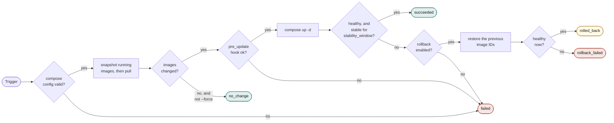
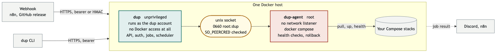

<div align="center">

# dup

### Webhook driven Docker Compose updates, with health checks and automatic rollback

[](https://github.com/9technologygroup/docker-updater/releases)
[](https://github.com/9technologygroup/docker-updater/actions/workflows/ci.yml)
[](LICENSE)
[](go.mod)
[](https://github.com/9technologygroup/docker-updater/stargazers)

[Documentation](DOCUMENTATION.md) · [Security model](SECURITY.md) · [Contributing](CONTRIBUTING.md)

</div>

---

## What is dup?

**dup** pulls and restarts a named Docker Compose stack, verifies it came up healthy, and rolls it back automatically if it did not.

Trigger it from a webhook (n8n, a GitHub release, anything that can POST), from the command line, or let it poll and update on a schedule with a soak delay.

```
$ dup list
dup 1.0.0  3 stacks configured, 2 on auto update
api https://127.0.0.1:7788   inbound token, github   outbound https://n8n.example.com/webhook/dup
server time Tue 18 Aug 2026 20:13:27 BST

STACK  CHECK  NEXT   SOAK  RB  SERVICES  DIR
app    6h     2h14m  30m   on  all       /opt/app
api    12h    9h02m  2h    on  api       /opt/api
db     -      -      -     on  all       /opt/db

In flight
  app  update waiting out its soak  applies 20:43:27 (in 30m)  new image for web

Not covered by dup
  compose project  monitoring  /opt/monitoring        running(3)
  loose container  watchtower  containrrr/watchtower  running
```

The caller names a **stack**, never a path and never a command. Everything else comes from a root-owned config file.

---

## Why dup?

- **A privileged agent you can actually reason about.** The network-facing half runs unprivileged with no Docker access at all. CI fails the build if it so much as links a package capable of executing `docker`.
- **Rollback that has been thought through.** It restores the previous image IDs, re-checks health, and tells you plainly when it could not, rather than reporting success and leaving you broken.
- **A soak, not a hair trigger.** A new image is recorded and applied only if it is still there after the soak window, so a tag pushed and pulled back within the hour never reaches you.
- **You can watch it work.** `dup update` shows each step as it runs, with a live timer, and prints the output of a step that failed rather than leaving you with "exit status 1". Redirected into a log there is no ANSI at all, just one line per step as it finishes.
- **Registry credentials per stack, not per host.** `sudo dup auth <stack>` verifies a username and password against the registry, then stores them `root:root 0600` where the network-facing service cannot read them. Two stacks can use different accounts on the same registry. A plain `sudo docker login` as root still works if that is all you need.
- **It tells you what it is not covering.** `dup list` enumerates every Compose project and loose container on the host that sits outside dup's control, because the dangerous stack is the one nobody is watching.
- **Two dependencies.** `gopkg.in/yaml.v3` and `golang.org/x/sys`. Everything else is the standard library.

---

## Quick start

```bash
curl -fsSL https://raw.githubusercontent.com/9technologygroup/docker-updater/main/install.sh | sudo sh
```

That verifies the download against `checksums.txt`, creates the `dup` system account, installs both binaries and both units, generates a bearer token, a webhook secret and a TLS certificate, writes a starter config, and starts up managing nothing.

Then see what is on the host and pick what dup should own:

```bash
sudo dup list                     # every stack on this host, all of it a candidate
sudo nano /etc/dup/config.yml     # add the ones you want under targets:
sudo dup check && sudo dup audit  # validate, and prove the privilege split holds
sudo systemctl restart dup-agent dup
```

Requires Linux, systemd and Docker Compose v2. Packages for Debian, RHEL and Alpine are on the [releases page](https://github.com/9technologygroup/docker-updater/releases).

Full install, configuration, usage and uninstall instructions are in **[DOCUMENTATION.md](DOCUMENTATION.md)**.

---

## How an update runs

Every update takes the same path, whoever triggered it. Nothing is recreated until the new image is on disk and the pre-update hook has succeeded.



A service with no `HEALTHCHECK` counts as healthy, so for those `stability_window` is your only real signal. That trade-off is explained in [DOCUMENTATION.md](DOCUMENTATION.md#health-checks-and-what-healthy-means).

---

## Architecture

Two binaries, split so the half exposed to the network has no way to reach Docker.

| Component | Runs as | Can reach | Job |
|---|---|---|---|
| `dup` | the `dup` system account | the agent's unix socket | HTTP API, auth, job store, scheduler, notifications |
| `dup-agent` | `root` | Docker | runs `docker compose`, health checks, rollback |

<div align="center">
  
</div>

The unprivileged half never touches Docker, and the privileged half never listens on the network. The socket is the only crossing, and the agent checks the caller's identity with `SO_PEERCRED` rather than trusting the socket mode alone.

Read [SECURITY.md](SECURITY.md) for the threat model, what the split does and does not protect against, and the ownership audit that enforces it.

---

## Documentation

| Document | What is in it |
|---|---|
| **[DOCUMENTATION.md](DOCUMENTATION.md)** | Install, configure, use, upgrade, uninstall. Every command and setting, the API, troubleshooting |
| **[SECURITY.md](SECURITY.md)** | The privilege split, the threat model, the ownership audit, reporting a vulnerability |
| **[CONTRIBUTING.md](CONTRIBUTING.md)** | Building, testing, the checks that gate a merge, and how a release is cut |

---

## Licence

AGPL-3.0-or-later. See [LICENSE](LICENSE).
