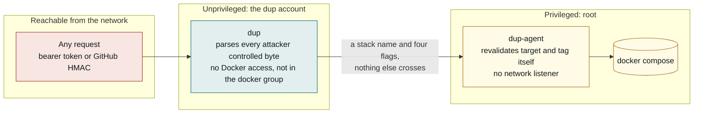

# Security

dup runs a root process that executes `docker compose` on your behalf, driven by something
reachable from the network. The whole design exists to make that arrangement defensible, so
this document is worth reading before you trust it.

- [Reporting a vulnerability](#reporting-a-vulnerability)
- [The privilege split](#the-privilege-split)
- [What the split does not protect](#what-the-split-does-not-protect)
- [Security controls](#security-controls)
- [File ownership, and the audit that enforces it](#file-ownership-and-the-audit-that-enforces-it)
- [Secrets](#secrets)
- [Supported versions](#supported-versions)

---

## Reporting a vulnerability

Please report security issues privately rather than opening a public issue.

Use [GitHub's private vulnerability reporting](https://github.com/9technologygroup/docker-updater/security/advisories/new)
on this repository. That opens a channel visible only to the maintainers.

Include what you were running (`dup version --full`), what you did, and what happened. A
proof of concept helps but is not required to make a report worth sending.

Please do not open a public issue, post to a forum, or disclose publicly until a fix is
available.

---

## The privilege split

Two processes, split on privilege.

```
  n8n / GitHub                    unix socket                  docker
  ──────────────▶       dup       ──────────▶     dup-agent      ──────────▶  compose
   HTTPS + basic    (unprivileged)  root:dup     (root, no network listener)
   auth via NPM     user: dup        0660
                    NO docker access
```

**`dup.service`** runs as the `dup` system account. It owns everything that touches attacker-controlled bytes: the HTTP listener, bearer-token and GitHub HMAC verification, JSON parsing, the job store, the auto-update scheduler, the outbound notify webhook. It has no Docker socket access and is not in the `docker` group.

**`dup-agent.service`** runs as root with no network listener at all. It accepts connections only on `/run/dup/agent.sock` (`root:dup`, mode `0660`) and does all the compose work.

This is enforced by what is compiled in, not only by configuration. The `dup` binary does not link the package that can execute `docker`, and a test asserts it:

```
$ go list -deps ./cmd/dup | grep internal/compose
$ go list -deps ./cmd/dup-agent | grep internal/compose
docker-updater/internal/compose
```

### Why not a user in the `docker` group

Because that is theatre. Docker socket access is root-equivalent:

```bash
docker run --rm -v /:/host --privileged alpine chroot /host sh
```

Anyone who can reach the socket is one command from root on the host and every container on it. A service account in the `docker` group looks safer on paper and buys nothing. The installer warns if `dup` ever ends up in that group.

The split is worth having, though not mainly because a memory-safety bug is likely. There is no cgo and no unsafe here, and the realistic bug in this codebase is an auth logic error, which the split does not help with. What it buys is structural: the dangerous capability is unreachable from the code that parses untrusted input, so the next person who adds an endpoint, a debug handler, or a "just let me pass a compose file" parameter is contained by architecture rather than by review vigilance.

Not using `sudo` is deliberate: `sudo` is setuid, which would force `NoNewPrivileges=true` off the unprivileged unit.




The only thing that crosses the boundary is a stack name and four booleans. The agent
revalidates both against its own config, so a value checked only in the API process counts
for nothing from the agent's point of view.


## What the split does not protect

- The agent is root and takes input over a socket the service account can write to. That is the trust boundary, and it is small on purpose: three endpoints, fixed JSON shapes with unknown fields rejected, a stack name looked up in the root-owned config, and a tag checked against the image-tag grammar. It re-validates everything rather than trusting the caller, holds its own per-stack lock, and caps concurrency.
- An attacker who lands as `dup` can still trigger redeploys of configured stacks. That is denial-of-service and a forced pull, not host compromise.
- **If the service account can write a stack's `docker-compose.yml` or its `.env`, the whole thing collapses.** It could add `privileged: true` and a bind mount of `/`, then ask the agent to deploy it as root. `.env` is just as dangerous, since compose reads it unconditionally and it can set `COMPOSE_FILE`, redirecting the agent at a different compose file entirely. Both are audited, and the audit is blocking.

## Security controls

| Control | What it does |
|---|---|
| Named stacks only | The request carries a stack name matched against the config. Directories, compose file names and service names live only in `/etc/dup/config.yml`. No parameter reaches a path or a command. |
| No shell | Every docker call is `exec` with an argv slice. Nothing is interpolated into a shell string. |
| Validated at load | `dir` must be absolute. `compose_file` and `env_file` must be bare filenames inside `dir`, and may not be symlinks pointing outside it. Stack and service names must match a strict regex, so a value can never be read as a docker flag. |
| Only one free parameter | `tag`, and only when the stack sets `image_tag_env`. Checked against the container image tag grammar by both processes. |
| Tag cannot change the image | Before applying a tag the agent resolves the stack with and without it and refuses if the repository moved, so `image: ${VERSION}` cannot be turned into "run whatever I name". |
| Unknown JSON fields rejected | On the public API and on the agent socket. |
| Loopback by default | Refuses to start on a non-loopback address unless `allow_non_loopback: true`. |
| Two inbound auth methods | Bearer token (constant-time compare of SHA-256 digests) and GitHub `X-Hub-Signature-256` HMAC over the raw body. After 20 failures in a minute the API returns 429 without sleeping, and a valid token does not clear that budget. |
| Peer credential check | On Linux the agent reads `SO_PEERCRED` and accepts only root and the configured `agent_peer_user`, on top of the socket mode. It fails closed. |
| Clean child environment | Docker is invoked with an explicit allowlisted environment, so `COMPOSE_FILE`, `COMPOSE_PROJECT_NAME` and `DOCKER_HOST` cannot be inherited into a compose call. |
| One update per stack | Enforced independently in both processes. |
| Notify URL is config-only | Never from a request, so the endpoint cannot be turned into an SSRF pivot. |
| Source allowlist | Optional `allow_from`, with `X-Forwarded-For` honoured only from configured `trusted_proxies`. |
| No CORS by default | A browser cannot use this API unless you name an origin explicitly. |

## File ownership, and the audit that enforces it

Nothing that decides what runs as root may be writable by the service account.

| Path | Owner | Mode |
|---|---|---|
| `/usr/bin/dup`, `/usr/bin/dup-agent` | `root:root` | `0755` |
| `/etc/dup/` | `root:dup` | `0750` |
| `/etc/dup/config.yml` | `root:dup` | `0640` |
| `bearer.token`, `github.secret` | `root:dup` | `0640` |
| every stack `dir`, its compose file, its `.env` | `root:root` | not writable by `dup` |
| every `pre_update.command` | `root:root` | not writable by `dup` |

The installer never prints either secret. Installer output has a habit of ending up in
shell scrollback, CI logs, terminal recordings and pasted bug reports, so read them
deliberately instead:

```bash
sudo cat /etc/dup/bearer.token
sudo cat /etc/dup/github.secret
```

To rotate one, overwrite it and restart. Anything of at least 32 characters is accepted,
and dup reads them at startup, so nothing is live until the restart:

```bash
( umask 077 && openssl rand -hex 32 | sudo tee /etc/dup/bearer.token >/dev/null )
sudo chown root:dup /etc/dup/bearer.token && sudo chmod 0640 /etc/dup/bearer.token
sudo systemctl restart dup
```

Rotate the GitHub secret the same way, then update it in the webhook settings. Rotating the
bearer token invalidates every caller using it, so update n8n and anything else first.

That `pre_update.command` row is the one that matters most and the one the installer cannot
fix for you:

```bash
dup audit
```

It walks each stack's directory, compose file, configured env file and implicit `.env` **and every parent directory up to `/`**, since write access to a parent is enough to replace the file underneath it. Where a path is a symlink it walks both the link's ancestors and the resolved target's. It reports anything the service account can write and exits non-zero.

This audit is **blocking, not advisory**. `install.sh` refuses to start the services if it fails, and `dup-agent.service` re-runs it as an `ExecStartPre`, so ownership drift later stops the agent rather than silently handing it a compose file the service account controls.

---

## Secrets

Two secrets live in `/etc/dup`, both `root:dup 0640`:

| File | What it authenticates |
|---|---|
| `bearer.token` | Callers of the HTTP API, including the `dup` CLI |
| `github.secret` | The HMAC on a GitHub webhook body |

Both are validated at load: at least 32 characters, owned by root, not world accessible or
group writable, and not sitting in a directory that is group or world writable. A file that
fails any of those is refused rather than used.

**The installer never prints them.** Installer output has a habit of ending up in shell
scrollback, CI logs, terminal recordings and pasted bug reports, so read them deliberately:

```bash
sudo cat /etc/dup/bearer.token
sudo cat /etc/dup/github.secret
```

Comparison is constant time on both paths. The bearer token is hashed before comparison so
neither its length nor its content leaks through timing, and the webhook HMAC uses
`hmac.Equal`. A present but invalid signature fails closed rather than falling through to
bearer auth.

### Rotating

Overwrite the file and restart. Anything of at least 32 characters is accepted, and dup reads
them at startup, so nothing is live until the restart. Update your callers first, because
rotating invalidates every one of them.

```bash
( umask 077 && openssl rand -hex 32 | sudo tee /etc/dup/bearer.token >/dev/null )
sudo chown root:dup /etc/dup/bearer.token && sudo chmod 0640 /etc/dup/bearer.token
sudo systemctl restart dup
```

Rotate `github.secret` the same way, then update it in the webhook settings.

### What is not a secret

The self-signed TLS certificate is a plain server certificate, not a CA, so importing it
cannot be used to vouch for any other name. Its private key is `root:dup 0640` and is never
printed.

---

## Supported versions

Only the latest release receives fixes. dup is pre-1.0 and moves quickly; there are no
maintained branches behind `main`.

| Version | Supported |
|---|---|
| Latest release | Yes |
| Anything older | No, upgrade |

`dup version` tells you when you are behind.

---

## See also

- [DOCUMENTATION.md](DOCUMENTATION.md) for install, configuration and usage
- [CONTRIBUTING.md](CONTRIBUTING.md) for the checks that gate a merge, including the
  privilege-split assertion in CI
